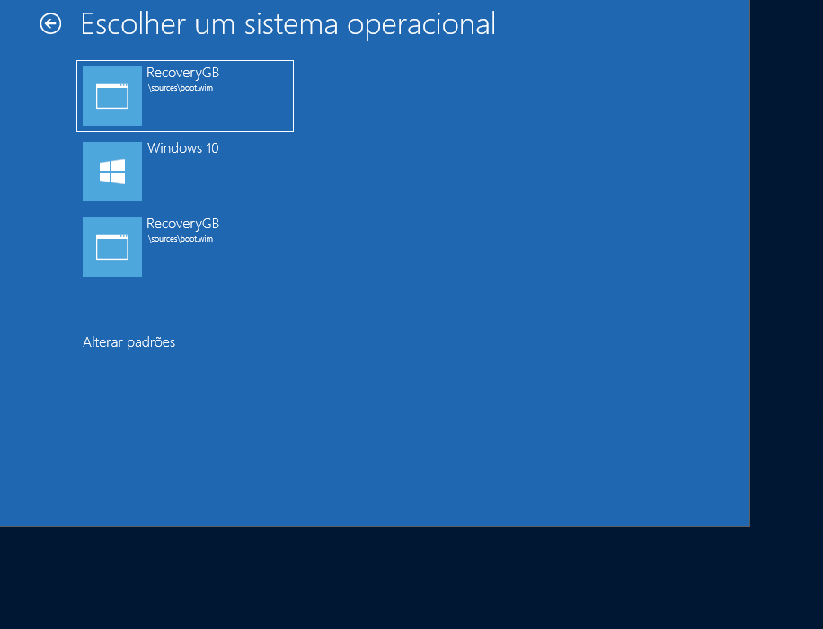

# Create Recovery Partition on the same HDD - Criar partição de recuperação do Windows

Digamos que voce tenha um cenario onde não seja possivel baixar uma imagem do Windows utilizando o WDS, SCCM, Intune em PXE devido a baixa capacidade de conectividade, como faria para recuperar um SO com Windows rapidamente? Uma solução simples sem necessidade de utilização de um WinPE, Ghost, Hirens ou Pendrive de instalação seria criar uma unidade de recuperação. Isso permite que o proprio usuário faça o processo de formatação. 

Vou compartilhar por aqui um projeto rapido para isso. O deploy do scritp em Powershell pode ser realizado por SCCM ou neste caso utilizamos o Landesk nos computadores alvo. 

# Sites de referência.

Customize seu projeto de acordo com sua necessidade. Aqui alguns links para ajudar na construção.

[Crie um script para identificar as partições de recuperação link](https://docs.microsoft.com/pt-br/previous-versions/windows/it-pro/windows-8.1-and-8/hh824917(v=win.10))

[Tipo de partição](https://docs.microsoft.com/pt-br/windows-hardware/customize/desktop/unattend/microsoft-windows-setup-diskconfiguration-disk-createpartitions-createpartition-type)

# Script completo Powershell

[Script Powershell Recovery Partition](https://github.com/alexandrecoradi/CreateRecoveryPartition/blob/main/RecoveryPartition.ps1)

# Download .ISO

    if ($null -eq (Test-Path $ISOPath)) 
    {
        $Action = "iniciando download"; Write-Log "Imagem nao encontrada, $Action"
        Get-Download $Source -Folder $Destination 
    } elseif ($HashFile -ne (Get-FileHash -Path $ISOPath -Algorithm SHA256).Hash) {
        $Action = "iniciando download"; Write-Log "Imagem corrompida, $Action novamente"
        Get-Download $Source -Folder $Destination 
    }
 
 # Criar partição
 
 Aqui o script valida o tamanho do disco C e criar uma novo volume com 8GB, se atente para deixar com o tamanho necessiario da sua imagem. 

    $Action = "Redimensiona particao"; Write-Log "Executando $Action"
    #Decidimos por não alterar as partições de Recovery padrao do Windows por conveniencia, sempre reduzindo a particao principal referente ao drive C
    $p = Get-Partition -DriveLetter C
    $p |Resize-Partition -Size ($p.size - 8589934592) #8GB, se sua imagem for maior aumente o tamanho para comportar

    $Action = "Cria particao Recovery"; Write-Log "Executando $Action"
    $np = New-Partition -DiskNumber 0 -UseMaximumSize -GptType $GPTType -DriveLetter $DriveLetter.ToString() |Format-Volume -FileSystem 'NTFS' -NewFileSystemLabel "Recovery"

# Extrair ISO para novo volume

Aqui poderia ter utilizado o DISM com função de Expand-Archive, mas neste caso foi com o 7z.exe. 

    $Action = "Extrai imagem"; Write-Log "Executando $Action"
    .\7z.exe x -y $ISOPath "-o${DriveLetter}`:\"
    
# Preparando partição para recovery

    $Action = "Customiza Windows Boot Manager"; Write-Log "Executando $Action"
    bcdedit /create `{ramdiskoptions`} /d "Ramdisk"
    bcdedit /set `{ramdiskoptions`} ramdisksdidevice partition=$DriveLetter`:
    bcdedit /set `{ramdiskoptions`} ramdisksdipath \boot\boot.sdi
    $gui = bcdedit /create /d "Recovery" /application OSLOADER
    $gui = "{$($gui -replace "^.*?{(.*?)}.*?$",'$1')}"
    bcdedit /set $gui device ramdisk=[$DriveLetter`:]\sources\boot.wim,`{ramdiskoptions`} 
    bcdedit /set $gui path \Windows\System32\winload.efi
    bcdedit /set $gui osdevice ramdisk=[$DriveLetter`:]\sources\boot.wim,`{ramdiskoptions`} 
    bcdedit /set $gui systemroot \windows
    bcdedit /set $gui winpe yes
    bcdedit /set $gui detecthal yes
    bcdedit /displayorder $gui /addlast
    bcdedit /timeout 0
    
# Removendo partição para não ficar visivel ao usuário. 

    $Action = "Remove letra de unidade da particao"; Write-Log "Executando $Action"
    $part = Get-Partition -DriveLetter $DriveLetter
    Remove-PartitionAccessPath -DiskNumber 0 -PartitionNumber $part.PartitionNumber -Accesspath "${DriveLetter}:"
    
# Criando chaves no registro para controle futuro. 

    if ($Error.Count -eq 0) {
        Write-Log  -LogText "Particao de recuperacao craida com sucesso."
        New-ItemProperty -Path $RegRecoveryPath -Name "RecoveryPartition" -Value "OK" -PropertyType String -Force
        New-ItemProperty -Path $RegRecoveryPath -Name "Data" -Value (Get-Date -Format dd/MM/yyyy).ToString() -PropertyType String -Force
        New-ItemProperty -Path $RegRecoveryPath -Name "File.ISO" -Value "Windows 10 Pro x64 Build 20H2" -PropertyType String -Force
  
    }
